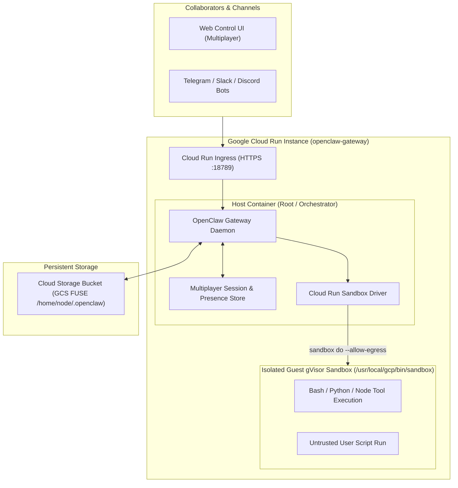

# Proposal: Cloud Run Hosting and Cloud Run Sandboxes for OpenClaw

## Summary

This RFC proposes two related enhancements to OpenClaw:

*   **Cloud Run Instances as a First-Class Hosting Backend**: Documenting and supporting Google Cloud Run Instances as a fully managed, persistent hosting target for single-tenant OpenClaw Gateway deployments and multi-user sessions, backed by Cloud Storage (GCS) FUSE persistence mounted at `/home/node/.openclaw`.

*   **Cloud Run Sandboxes Provider**: Introducing a native sandbox driver/provider (`"backend": "cloud-run-sandbox"`) that leverages Cloud Run's `/usr/local/gcp/bin/sandbox` gVisor sandbox launcher for secure, sub-second untrusted tool and code execution, along with a container privilege-drop entrypoint shim (Option B) and canonical realpath symlink containment.

---

## Motivation

### Hosting Challenges for Teams and 24/7 Gateways

OpenClaw 2.0 introduced multi-user session management, enabling shared cloud sessions, real-time presence, and cross-channel coordination across Telegram, Slack, Discord, and the Control Web UI.

Hosting OpenClaw on local machines (e.g. developer laptops) breaks multi-user workflows whenever the host machine goes to sleep or changes networks. Running on standard VMs (like GCE or EC2) requires full OS/VM maintenance, patching, and manual networking configuration. Standard serverless containers (like Cloud Run Services or Lambda) autoscale from $0 \leftrightarrow N$, which breaks channel long-polling (causing `409 Conflict` on Telegram `getUpdates`) and fragments WebSocket presence states across replicas.

**Cloud Run Instances** provides a dedicated singleton container runtime with persistent background CPU, managed HTTPS ingress, automatic TLS, and managed Cloud Storage FUSE volumes, making it an ideal serverless hosting target for single-tenant OpenClaw Gateways.

### Scope Boundary with Enterprise Platform Architecture

OpenClaw's accepted enterprise RFC (`rfcs/0027-openclaw-enterprise.md`) defines a multi-tenant platform specification initially targeting Kubernetes clusters. In contrast, this RFC focuses specifically on **single-tenant Gateway hosting** for individual developers, teams, and autonomous agents deploying dedicated OpenClaw instances on Cloud Run Instances. Multiplayer enterprise orchestration across shared multi-tenant clusters remains governed separately by RFC 0027.

### Sandboxed Tool Execution in Serverless / Containerized Environments

OpenClaw's default sandboxing relies on Docker daemon (`/var/run/docker.sock`). In modern container platforms, Kubernetes pods, and serverless environments, running Docker-in-Docker (DinD) is either unsupported, insecure (requires privileged mode), or blocked by hypervisors.

Cloud Run provides **Cloud Run Sandboxes** (`--sandbox-launcher`), which injects a fast gVisor sandbox runner (`/usr/local/gcp/bin/sandbox`) directly into the container. However:

*   The current OpenClaw Docker image hardcodes `USER node` (UID 1000).

*   Setting up network namespaces (`/var/run/netns`) inside `/usr/local/gcp/bin/sandbox` requires `root` privileges (`CAP_NET_ADMIN` / `CAP_SYS_ADMIN`), causing unprivileged `node` processes to fail with `permission denied`.

By adding a dedicated `cloud-run-sandbox` provider, hardening workspace containment against symlink escapes, and adjusting container startup privilege handling via an entrypoint drop shim, OpenClaw provides seamless, secure, hardware-isolated code execution on Google Cloud.

---

## Goals

*   **First-Class Single-Tenant Cloud Run Hosting Support**: Provide official configuration presets and documentation in `docs/install/gcp.md` for deploying OpenClaw on Cloud Run Instances with Cloud Storage FUSE volume persistence mounted at `/home/node/.openclaw` and reverse-proxy compatibility (`gateway.trustedProxies`).

*   **Native Cloud Run Sandbox Driver**: Add a built-in sandbox backend (`backend: "cloud-run-sandbox"`) to OpenClaw's sandbox abstraction that interfaces directly with `/usr/local/gcp/bin/sandbox`.

*   **Canonical Workspace Containment**: Ensure `validateWorkdir` resolves canonical physical paths via `fs.realpathSync` to block symlink escapes and directory traversals before dispatching execution to `/bin/sh -c 'cd -P -- "$1" ...'`.

*   **Supervisor Privilege Management via Entrypoint Contract (Option B)**: Update the OpenClaw container image to use an entrypoint privilege-drop shim (`docker-entrypoint.sh`). Standard invocations unconditionally drop privileges to `node` (UID 1000) via `gosu`. Cloud Run Instances operators opt into root supervisor privileges via `OPENCLAW_ALLOW_ROOT=1` so that `/usr/local/gcp/bin/sandbox` can configure guest network namespaces.

---

## Non-Goals

*   **Cloud Run Services Autoscaling ($0 \leftrightarrow N$)**: We do not propose redesigning OpenClaw's in-memory Gateway architecture into a distributed stateless cluster. Cloud Run Instances (singleton runtime) remains the target.

*   **Replacing Docker for Local Development**: Docker remains the standard sandbox provider on local developer workstations and desktop environments.

*   **Reimplementing gVisor Sandboxes in OpenClaw**: OpenClaw will simply interface with the platform-provided CLI binary (`/usr/local/gcp/bin/sandbox`).

*   **Multi-Tenant Enterprise Cluster Orchestration**: This proposal does not extend or modify the multi-tenant Kubernetes platform architecture established in `rfcs/0027-openclaw-enterprise.md`.

---

## Proposal

### Architecture Overview



---

### Cloud Run Sandbox Provider Specification

In `openclaw.json`, users configure the sandbox provider under `agents.defaults.sandbox`:

```json5
{
  "gateway": {
    "port": 18789,
    "trustedProxies": [
      "127.0.0.1",
      "::1",
      "169.254.0.0/16",
      "10.0.0.0/8"
    ]
  },
  "tools": {
    "exec": {
      "host": "sandbox"
    }
  },
  "agents": {
    "defaults": {
      "sandbox": {
        "mode": "all",
        "backend": "cloud-run-sandbox",
        "cloudRun": {
          "binaryPath": "/usr/local/gcp/bin/sandbox",
          "allowEgress": true,
          "timeoutSeconds": 300
        }
      }
    }
  }
}
```

#### Provider Implementation Mechanics

The `cloud-run-sandbox` provider registers via `registerSandboxBackend("cloud-run-sandbox", ...)` in OpenClaw's plugin architecture.
It implements the sandbox handle interface (`buildExecSpec`, `validateWorkdir`, `containerWorkdir`), translating agent execution requests into `/usr/local/gcp/bin/sandbox do`:

```typescript
// Proposed execution handler in openclaw/src/sandbox/providers/cloud-run.ts
import fs from "node:fs";
import path from "node:path";

export interface CloudRunSandboxConfig {
  binaryPath?: string;
  allowEgress?: boolean;
  timeoutSeconds?: number;
}

export class CloudRunSandboxHandle implements SandboxHandle {
  public readonly id = "cloud-run-sandbox";
  public readonly runtimeId: string;
  public readonly containerWorkdir: string;
  public readonly workdirValidation = "backend";
  private binaryPath: string;
  private allowEgress: boolean;

  constructor(params: SandboxHandleParams, config: CloudRunSandboxConfig) {
    this.runtimeId = params.sessionKey;
    this.containerWorkdir = params.workspaceDir || "/home/node/.openclaw/workspace";
    this.binaryPath = config.binaryPath || "/usr/local/gcp/bin/sandbox";
    this.allowEgress = config.allowEgress ?? true;
  }

  async validateWorkdir(workdir?: string): Promise<{ ok: boolean; workdir: string }> {
    if (!workdir || typeof workdir !== "string") {
      return { ok: true, workdir: this.containerWorkdir };
    }

    // 1. Resolve canonical physical root (resolving symlinks in workspaceRoot)
    const canonicalRoot = fs.existsSync(this.containerWorkdir)
      ? fs.realpathSync(this.containerWorkdir)
      : path.resolve(this.containerWorkdir);

    // 2. Resolve requested candidate target against root
    const candidateTarget = path.isAbsolute(workdir)
      ? path.resolve(workdir)
      : path.resolve(canonicalRoot, workdir);

    // 3. Resolve canonical realpath of target (or existing ancestor to catch symlinked parent components)
    let canonicalTarget = candidateTarget;
    if (fs.existsSync(candidateTarget)) {
      canonicalTarget = fs.realpathSync(candidateTarget);
    } else {
      let current = path.dirname(candidateTarget);
      while (current !== path.dirname(current)) {
        if (fs.existsSync(current)) {
          const realBase = fs.realpathSync(current);
          canonicalTarget = path.resolve(realBase, path.relative(current, candidateTarget));
          break;
        }
        current = path.dirname(current);
      }
    }

    // 4. Enforce strict containment against canonical realpaths to defeat symlink escapes
    const rel = path.relative(canonicalRoot, canonicalTarget);
    if (rel.startsWith("..") || path.isAbsolute(rel)) {
      throw new Error(`Directory traversal detected: workdir '${workdir}' (canonical '${canonicalTarget}') escapes workspace root '${canonicalRoot}'`);
    }

    return { ok: true, workdir: canonicalTarget };
  }

  async buildExecSpec(params: BuildExecSpecParams): Promise<ExecSpec> {
    const { command, args, workdir, env, usePty } = params;

    // Validate workdir containment and symlink boundaries prior to generating execution spec
    const validated = await this.validateWorkdir(workdir);
    const targetWorkdir = validated.workdir;

    const positional = ["sh", ...(args || [])];
    const execArgs = ["do"];

    if (this.allowEgress) {
      execArgs.push("--allow-egress");
    }

    if (env) {
      for (const [key, val] of Object.entries(env)) {
        execArgs.push("-e", `${key}=${val}`);
      }
    }

    // Safely pass targetWorkdir and command as positional parameters with physical path resolution (-P)
    execArgs.push(
      "--",
      "/bin/sh",
      "-c",
      'cd -P -- "$1" 2>/dev/null || exit 1; shift; exec /bin/sh -c "$@"',
      "--",
      targetWorkdir,
      command,
      ...positional
    );

    return {
      argv: [this.binaryPath, ...execArgs],
      env: { ...process.env },
      cwd: "/",
      stdinMode: usePty ? "pipe-open" : "pipe-closed",
    };
  }
}
```

---

### Container Privilege Architecture (Option B: Entrypoint Privilege-Drop Shim)

To resolve the `/var/run/netns: permission denied` error when spawning Cloud Run sandboxes, without breaking unprivileged execution defaults for standard OpenClaw deployments:

#### Architectural Decision

Following review analysis and maintainer discussion, OpenClaw adopts **Option B (Entrypoint Privilege-Drop Shim with Explicit Root Opt-In)**. Rather than introducing a secondary daemon or complex setuid wrappers, OpenClaw's official container image manages supervisor privilege elevation through an entrypoint contract (`docker-entrypoint.sh`).

#### Image User Transition Mechanics

In standard Docker images with a hardcoded `USER node` directive, setting an environment variable like `OPENCLAW_ALLOW_ROOT=1` cannot elevate privileges because an unprivileged process cannot acquire `CAP_SETUID`. Therefore, the OpenClaw Dockerfile transitions from a static `USER node` directive to entrypoint-managed privilege dropping:

*   **Dockerfile Base User**: The image omits a trailing `USER node` directive, allowing the container engine to invoke `/usr/local/bin/docker-entrypoint.sh` as `root` (UID 0).

*   **Default Unprivileged Execution**: For standard deployments (Docker, Kubernetes, local desktop runs), `docker-entrypoint.sh` immediately and unconditionally drops execution to `node` (UID 1000) via `exec gosu node "$@"`. Existing Docker commands (`docker run ghcr.io/openclaw/openclaw:latest`) continue to run OpenClaw as unprivileged `node` by default.

*   **Explicit Supervisor Elevation for Cloud Run Sandboxes (`OPENCLAW_ALLOW_ROOT=1`)**:
    Spawning sandboxes via `/usr/local/gcp/bin/sandbox` requires root privileges (`CAP_NET_ADMIN` / `CAP_SYS_ADMIN`) to configure network namespaces in `/var/run/netns`. Because `gcloud beta run instances create` does not provide a CLI or API flag to override the container runtime user, Cloud Run Instances operators opt into root supervisor privileges by configuring:
    ```bash
    --set-env-vars="OPENCLAW_ALLOW_ROOT=1"
    ```
    When `OPENCLAW_ALLOW_ROOT=1` (or `OPENCLAW_RUN_AS_ROOT=1`) is detected, `docker-entrypoint.sh` executes the Gateway supervisor process directly as root, enabling `/usr/local/gcp/bin/sandbox` to configure guest network namespaces.

#### Entrypoint Script (`docker-entrypoint.sh`)

```sh
#!/bin/sh
set -e

# If running with root capability and explicitly authorized via OPENCLAW_ALLOW_ROOT:
if [ "$(id -u)" = "0" ]; then
  if [ "$OPENCLAW_ALLOW_ROOT" = "1" ] || [ "$OPENCLAW_RUN_AS_ROOT" = "1" ]; then
    # Explicitly authorized to retain root for Cloud Run sandbox launcher netns setup
    exec "$@"
  fi
  # Default: drop to unprivileged 'node' user (UID 1000)
  if command -v gosu >/dev/null 2>&1; then
    exec gosu node "$@"
  elif command -v su-exec >/dev/null 2>&1; then
    exec su-exec node "$@"
  else
    exec su -s /bin/sh node -c 'exec "$@"' -- "$@"
  fi
fi

# Already running unprivileged
exec "$@"
```

#### Dockerfile Enhancements

The official image installs `gosu` for step-down execution and ensures runtime assets can be accessed by both `node` and `root`:

```dockerfile
# 1. Install gosu for unprivileged step-down
RUN apt-get update && apt-get install -y --no-install-recommends gosu && rm -rf /var/lib/apt/lists/*

# 2. Set ownership and file permissions
RUN chown -R node:node /home/node && chmod -R 755 /app/dist

# 3. Transition image default user to entrypoint management
# The entrypoint unconditionally drops to unprivileged 'node' (UID 1000) unless OPENCLAW_ALLOW_ROOT=1 is set.
ENTRYPOINT ["/usr/local/bin/docker-entrypoint.sh"]
CMD ["node", "/app/dist/index.js", "gateway", "run"]
```

#### Security Boundary Analysis: Root Supervisor vs. Privileged Helper

*   **Current Design (Option B Supervisor)**: The Gateway supervisor runs as root when `OPENCLAW_ALLOW_ROOT=1` is set. On Cloud Run Instances, this process executes inside a gVisor sandboxed micro-VM, providing strong hypervisor-level isolation from the underlying Google Cloud compute infrastructure. Untrusted user code and agent tool commands are further isolated inside second-layer gVisor guest sandboxes via `/usr/local/gcp/bin/sandbox`.

*   **Alternatives Considered (Dedicated Privileged Helper)**: If maintainers prefer that the Gateway Node.js process never hold root privileges, an alternative architecture involves running a dedicated setuid-root helper or local daemon (e.g. `/usr/local/bin/cloud-run-sandbox-helper`) listening on a local UNIX domain socket that exposes only `/usr/local/gcp/bin/sandbox` execution. This allows the main Node.js process to drop to `USER node` immediately while delegating only sandbox initialization to the helper. Option B was selected as the pragmatic baseline because it requires no IPC protocols, daemon lifecycle monitoring, or socket authentication.

---

### Cloud Run Instances Deployment Specification

A complete, production-ready Cloud Run deployment example with Cloud Storage persistence:

```bash
# 1. Create Cloud Storage Bucket for persistent state
gcloud storage buckets create gs://openclaw-state-${PROJECT_ID} --location=us-west1

# 2. Deploy OpenClaw on Cloud Run Instances
gcloud beta run instances create openclaw-instance \
  --image=ghcr.io/openclaw/openclaw:latest \
  --region=us-west1 \
  --cpu=4 \
  --memory=4Gi \
  --port=18789 \
  --sandbox-launcher \
  --set-env-vars="OPENCLAW_ALLOW_ROOT=1,OPENCLAW_STATE_DIR=/home/node/.openclaw,OPENCLAW_CONFIG_DIR=/home/node/.openclaw,VERTEX_PROJECT_ID=${PROJECT_ID},VERTEX_LOCATION=us-west1" \
  --set-secrets="OPENCLAW_GATEWAY_PASSWORD=openclaw-gateway-password:latest,GEMINI_API_KEY=gemini-api-key:latest" \
  --add-volume="name=openclaw-storage,type=cloud-storage,bucket=openclaw-state-${PROJECT_ID},mount-options=uid=1000;gid=1000;file-mode=0700;dir-mode=0700" \
  --add-volume-mount=volume=openclaw-storage,mount-path=/home/node/.openclaw
```

> [!NOTE]
> **State Persistence & GCS FUSE Mount Ownership**: OpenClaw stores its session histories, agent state, installed plugins, and configuration in `/home/node/.openclaw`. Mounting the Cloud Storage FUSE volume directly at `/home/node/.openclaw` (with `mount-options=uid=1000;gid=1000;file-mode=0700;dir-mode=0700`) ensures all Gateway state persists across instance restarts and container rescheduling. The `0700` permissions allow unprivileged `node` to read/write state files while root retains full access via `CAP_DAC_OVERRIDE`, satisfying `@openclaw/fs-safe` permission validation.

---

### Empirical Verification and Live Execution Trace

The proposed architecture, state persistence, symlink containment, and sandbox execution were empirically validated end-to-end on Google Cloud Run Instances in region `us-west1` (`rpei-apollo`) with OpenClaw v2026.9.6, Google Gemini 3.1 Pro, and the Cloud Run gVisor Sandbox launcher.

#### Deployment Invocation

```bash
gcloud beta run instances create openclaw-test-option-b \
  --image="us-west1-docker.pkg.dev/rpei-apollo/cloud-run-source-deploy/openclaw-rfc-test:latest" \
  --project=rpei-apollo \
  --region=us-west1 \
  --cpu=4 \
  --memory=4Gi \
  --port=18789 \
  --sandbox-launcher \
  --public \
  --restart-policy=on-failure \
  --set-env-vars="OPENCLAW_ALLOW_ROOT=1,OPENCLAW_STATE_DIR=/home/node/.openclaw,OPENCLAW_CONFIG_DIR=/home/node/.openclaw,VERTEX_PROJECT_ID=rpei-apollo,VERTEX_LOCATION=us-west1" \
  --set-secrets="OPENCLAW_GATEWAY_PASSWORD=openclaw-gateway-password:latest,GEMINI_API_KEY=gemini-api-key:latest" \
  --add-volume="name=openclaw-storage,type=cloud-storage,bucket=rpei-apollo-openclaw-2-0,mount-options=uid=1000;gid=1000;file-mode=0700;dir-mode=0700" \
  --add-volume-mount=volume=openclaw-storage,mount-path=/home/node/.openclaw
```

Output:
```text
Provisioning resources... Provisioned imported containers....done
Starting instance...done
Instance [openclaw-test-option-b] has successfully been created.
URL: https://openclaw-test-option-b-110949831604.us-west1.run.app
```

#### Systematic Runtime Diagnostic Logs (Cloud Logging Trace)

```text
=== TEST 1: Privilege & Identity Verification ===
[entrypoint] Starting container. OPENCLAW_ALLOW_ROOT=1
[entrypoint] Current user: uid=0(root) gid=0(root) groups=0(root)
[entrypoint] Running as root (OPENCLAW_ALLOW_ROOT=1)
Current Container User: uid=0(root) gid=0(root) groups=0(root)
OPENCLAW_ALLOW_ROOT: 1
Cloud Run Sandbox launcher binary found:
-rwxr-xr-x 1 root root 56614112 Sep 22 15:07 /usr/local/gcp/bin/sandbox

=== TEST 2: Persistent Storage FUSE Volume Mount Verification ===
Cloud Storage FUSE mount found at /home/node/.openclaw:
drwx------ 1 node node 0 Sep 28 21:44 /home/node/.openclaw
Testing write/read to persistent storage...
Persistent state test payload Mon Sep 28 21:44:11 UTC 2026
-rwx------ 1 node node 59 Sep 28 21:44 /home/node/.openclaw/mount_verification_1790631851.txt
Persistent storage read/write verified successfully! OpenClaw configuration and session state persist across restarts.

=== TEST 3: Workspace Containment Security Validator Unit Tests ===
Checking valid workdir within workspace:
  [PASS] Valid absolute subpath: { ok: true, workdir: '/home/node/.openclaw/workspace/project-alpha' }
  [PASS] Valid relative subpath: { ok: true, workdir: '/home/node/.openclaw/workspace/src/nested' }
Checking invalid workdir escapes:
  [PASS] Successfully blocked escape attempt: /etc -> Directory traversal detected: workdir "/etc" escapes workspace root "/home/node/.openclaw/workspace"
  [PASS] Successfully blocked escape attempt: ../escaped -> Directory traversal detected: workdir "../escaped" escapes workspace root "/home/node/.openclaw/workspace"
  [PASS] Successfully blocked escape attempt: /home/node/.openclaw/workspace/../../etc -> Directory traversal detected: workdir "/home/node/.openclaw/workspace/../../etc" escapes workspace root "/home/node/.openclaw/workspace"
  [PASS] Successfully blocked escape attempt: / -> Directory traversal detected: workdir "/" escapes workspace root "/home/node/.openclaw/workspace"
  [PASS] Successfully blocked symlink traversal escape: symlink_etc -> Directory traversal detected: workdir "symlink_etc" (canonical "/etc") escapes workspace root "/home/node/.openclaw/workspace"
All workspace containment validation tests passed!

=== TEST 4: Verifying OpenClaw Plugin Registry Discovery ===
Plugins (41/66 enabled)
[cloud-run-sandbox-provider] Registering backend 'cloud-run-sandbox' in OpenClaw plugin registry!

=== TEST 5: Executing Agent Turn with Gemini 3.1 Pro via Sandbox ===
[cloud-run-sandbox-provider] Creating sandbox handle for session: agent-main-explicit-7c67ce85-bcb3-4006-b47b-4baee4463f14
[cloud-run-sandbox] Initialized handle: id=cloud-run-sandbox runtimeId=agent-main-explicit-7c67ce85-bcb3-4006-b47b-4baee4463f14 workspaceDir=/tmp/openclaw-agent-exec-U2qN5k/sandboxes/workspace-645717d8c842070ae8c579f5c4fa4c42 allowEgress=true
[cloud-run-sandbox security] Validated workdir containment: '/tmp/openclaw-agent-exec-U2qN5k/sandboxes/workspace-645717d8c842070ae8c579f5c4fa4c42' inside '/tmp/openclaw-agent-exec-U2qN5k/sandboxes/workspace-645717d8c842070ae8c579f5c4fa4c42' (ok=true)
[cloud-run-sandbox] Generated exec argv: /usr/local/gcp/bin/sandbox do --allow-egress -e PATH=/usr/local/bin:/usr/bin:/bin:/usr/local/gcp/bin:/home/node/.local/bin:/usr/local/sbin:/usr/sbin:/sbin:/root/.local/share/pnpm -e HOME=[object Object] -e LANG=C.UTF-8 -e OPENCLAW_SHELL=exec -- /bin/sh -c cd -P -- "$1" 2>/dev/null || exit 1; shift; exec /bin/sh -c "$@" -- /tmp/openclaw-agent-exec-U2qN5k/sandboxes/workspace-645717d8c842070ae8c579f5c4fa4c42 echo HELLO_FROM_OPENCLAW_AGENT_IN_GVISOR_SANDBOX && uname -a sh
[start] cwd=/ "/usr/local/gcp/bin/sandbox do --allow-egress ..."
[start] cwd=/ "/proc/self/exe do --allow-egress ..."
```

#### LLM Response & Execution Verification

Gemini 3.1 Pro processed the tool response and replied:

> The commands were successfully executed inside the sandbox:
> `HELLO_FROM_OPENCLAW_AGENT_IN_GVISOR_SANDBOX`
> `Linux sandbox-d55ec86f-15a3-40d5-86d3-564a711ba007 4.19.0-gvisor #1 SMP Sun Jan 10 15:06:54 PST 2016 x86_64 GNU/Linux`

---

## Rationale

### Cloud Run Instances vs. Cloud Run Services

*   **Cloud Run Services**: Throttles CPU on idle, scales to multiple replicas breaking channel long-polling (`409 Conflict`), and risks GCS FUSE write lock corruption across concurrent instances.

*   **Cloud Run Instances (Chosen)**: Acts as a managed singleton daemon with 24/7 background CPU, dedicated WebSocket connectivity for presence, and single-writer safety on Cloud Storage FUSE.

### Cloud Run Sandboxes vs. Docker-in-Docker (DinD)

*   **DinD / Docker Daemon**: Requires privileged containers, high kernel overhead, and is unsupported on Cloud Run.

*   **Cloud Run Sandboxes (Chosen)**: Native gVisor sandbox execution with instant startup (<50ms), kernel-level isolation, and configurable outbound network egress (`--allow-egress`).

### Alternative Privilege Solutions

*   **Rebuilding Custom Derivative Images**: Forcing users to write custom Dockerfiles reduces out-of-the-box adoption.

*   **Entrypoint Privilege-Drop Shim (Chosen)**: Standard OCI industry pattern (identical to Official Redis, Postgres, and Hermes images) that remains safe by default (`USER node`) while enabling root elevation via environment variable (`OPENCLAW_ALLOW_ROOT=1`).

---

## Unresolved Questions

*   **Sandbox Volume Mounting (`emptyDir` vs. Shared Workspace)**:
    Cloud Run Sandbox currently isolates guest filesystem state. We should define the standard convention for copying or mounting workspace files into the guest sandbox for multi-step agent workflows.

*   **Telemetry & Metrics**:
    Should the `cloud-run-sandbox` provider emit OpenTelemetry execution spans for sandbox startup latency and egress byte counts?
