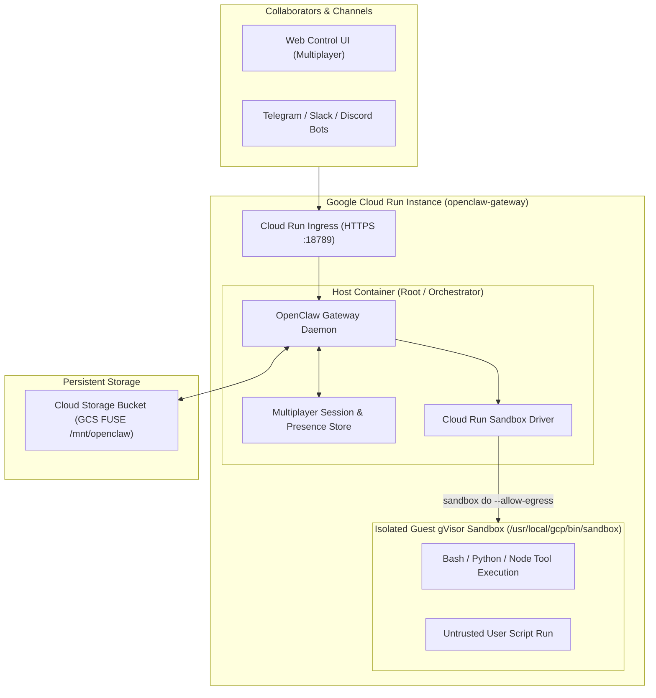

# Proposal: Cloud Run Hosting and Cloud Run Sandboxes for OpenClaw

## Summary

This RFC proposes two related enhancements to OpenClaw:
1. **Cloud Run Instances as a First-Class Hosting Backend**: Documenting and supporting Google Cloud Run Instances as a fully managed, persistent hosting target for the OpenClaw Gateway and Multiplayer (Multi-User) mode, with Cloud Storage (GCS) FUSE persistence.
2. **Cloud Run Sandboxes Provider**: Introducing a native sandbox driver/provider (`"backend": "cloud-run-sandbox"`) that leverages Cloud Run's `/usr/local/gcp/bin/sandbox` gVisor sandbox launcher for secure, sub-second untrusted tool and code execution, along with a container privilege-drop entrypoint shim in the official Docker image to enable unprivileged sandboxing.

---

## Motivation

### 1. Hosting Challenges for Teams and 24/7 Gateways
OpenClaw 2.0 introduced **Multiplayer / Multi-User mode**, enabling shared cloud sessions, real-time presence, and cross-channel coordination across Telegram, Slack, Discord, and the Control Web UI.
Hosting OpenClaw on local machines (e.g. developer laptops) breaks multiplayer workflows whenever the host machine goes to sleep or changes networks. Running on standard VMs (like GCE or EC2) requires full OS/VM maintenance, patching, and manual networking configuration. Standard serverless containers (like Cloud Run Services or Lambda) autoscale from $0 \leftrightarrow N$, which breaks channel long-polling (causing `409 Conflict` on Telegram `getUpdates`) and fragments WebSocket presence states across replicas.

**Cloud Run Instances** provides a dedicated singleton container runtime with persistent background CPU, managed HTTPS ingress, automatic TLS, and managed Cloud Storage FUSE volumes, making it an ideal serverless hosting target for OpenClaw.

### 2. Sandboxed Tool Execution in Serverless / Containerized Environments
OpenClaw's default sandboxing relies on Docker daemon (`/var/run/docker.sock`). In modern container platforms, Kubernetes pods, and serverless environments, running Docker-in-Docker (DinD) is either unsupported, insecure (requires privileged mode), or blocked by hypervisors.

Cloud Run provides **Cloud Run Sandboxes** (`--sandbox-launcher`), which injects a fast gVisor sandbox runner (`/usr/local/gcp/bin/sandbox`) directly into the container. However:
- The current OpenClaw Docker image hardcodes `USER node` (UID 1000).
- Setting up network namespaces (`/var/run/netns`) inside `/usr/local/gcp/bin/sandbox` requires `root` privileges (`CAP_NET_ADMIN` / `CAP_SYS_ADMIN`), causing unprivileged `node` processes to fail with `permission denied`.

By adding a dedicated `cloud-run-sandbox` provider and adjusting container startup privilege handling, OpenClaw can provide seamless, secure, hardware-isolated code execution on Google Cloud.

---

## Goals

1. **First-Class Cloud Run Hosting Support**: Provide official configuration presets and documentation in `docs/install/gcp.md` for deploying OpenClaw on Cloud Run Instances with Cloud Storage FUSE volume persistence and reverse-proxy compatibility (`gateway.trustedProxies`).
2. **Native Cloud Run Sandbox Driver**: Add a built-in sandbox backend (`backend: "cloud-run-sandbox"`) to OpenClaw's sandbox abstraction that interfaces directly with `/usr/local/gcp/bin/sandbox`.
3. **Flexible Container Privilege Management**: Update the OpenClaw Docker entrypoint to start as `root` by default, dropping to `node` (UID 1000) unless an environment variable (`OPENCLAW_ALLOW_ROOT=1` or `OPENCLAW_RUN_AS_ROOT=1`) or CLI flag (`--allow-root`) is set to allow sandbox creation.

---

## Non-Goals

1. **Cloud Run Services Autoscaling ($0 \leftrightarrow N$)**: We do not propose redesigning OpenClaw's in-memory Gateway architecture into a distributed stateless cluster. Cloud Run Instances (singleton runtime) remains the target.
2. **Replacing Docker for Local Development**: Docker remains the standard sandbox provider on local developer workstations and desktop environments.
3. **Reimplementing gVisor Sandboxes in OpenClaw**: OpenClaw will simply interface with the platform-provided CLI binary (`/usr/local/gcp/bin/sandbox`).

---

## Proposal

### 1. Architecture Overview



---

### 2. Cloud Run Sandbox Provider Specification

In `openclaw.json`, users configure the sandbox provider under `agents.defaults.sandbox`:

```json5
{
  "gateway": {
    "port": 18789,
    "trustedProxies": [
      "127.0.0.1",
      "::1",
      "169.254.0.0/16",
      "10.0.0.0/8"
    ]
  },
  "tools": {
    "exec": {
      "host": "sandbox"
    }
  },
  "agents": {
    "defaults": {
      "sandbox": {
        "mode": "all",
        "backend": "cloud-run-sandbox",
        "cloudRun": {
          "binaryPath": "/usr/local/gcp/bin/sandbox",
          "allowEgress": true,
          "timeoutSeconds": 300
        }
      }
    }
  }
}
```

#### Provider Implementation Mechanics
The `cloud-run-sandbox` provider registers via `registerSandboxBackend("cloud-run-sandbox", ...)` in OpenClaw's plugin architecture.
It implements the sandbox handle interface (`buildExecSpec`, `validateWorkdir`, `containerWorkdir`), translating agent execution requests into `/usr/local/gcp/bin/sandbox do`:

```typescript
// Proposed execution handler in openclaw/src/sandbox/providers/cloud-run.ts
export class CloudRunSandboxHandle implements SandboxHandle {
  public readonly id = "cloud-run-sandbox";
  public readonly runtimeId: string;
  public readonly containerWorkdir: string;
  public readonly workdirValidation = "backend";
  private binaryPath: string;
  private allowEgress: boolean;

  constructor(params: SandboxHandleParams, config: CloudRunSandboxConfig) {
    this.runtimeId = params.sessionKey;
    this.containerWorkdir = params.workspaceDir || "/";
    this.binaryPath = config.binaryPath || "/usr/local/gcp/bin/sandbox";
    this.allowEgress = config.allowEgress ?? true;
  }

  async validateWorkdir(workdir: string): Promise<{ ok: boolean; workdir: string }> {
    return { ok: true, workdir };
  }

  async buildExecSpec(params: BuildExecSpecParams): Promise<ExecSpec> {
    const { command, args, workdir, env, usePty } = params;
    const positional = ["sh", ...(args || [])];
    const execArgs = ["do"];

    if (this.allowEgress) {
      execArgs.push("--allow-egress");
    }

    if (env) {
      for (const [key, val] of Object.entries(env)) {
        execArgs.push("-e", `${key}=${val}`);
      }
    }

    let fullCommand = command;
    if (workdir && workdir !== "/") {
      fullCommand = `cd ${workdir} 2>/dev/null || true; ${command}`;
    }

    execArgs.push("--", "/bin/sh", "-c", fullCommand, ...positional);

    return {
      argv: [this.binaryPath, ...execArgs],
      env: { ...process.env },
      cwd: "/",
      stdinMode: usePty ? "pipe-open" : "pipe-closed",
    };
  }
}
```

---

### 3. Container Privilege & Entrypoint Architecture

To resolve the `/var/run/netns: permission denied` error without compromising security for non-cloud users:

1. **Dockerfile Configuration**:
   The Docker image retains `USER root` as its default user, ensures plugin/extension directories are owned by root (`RUN chown -R root:root /app/extensions /app/plugins /app/dist` to satisfy OpenClaw's root-execution integrity checks), and installs `gosu` (or `su-exec` on Alpine):
   ```dockerfile
   RUN apt-get update && apt-get install -y --no-install-recommends gosu && rm -rf /var/lib/apt/lists/*
   RUN chown -R root:root /app/extensions /app/plugins /app/dist
   ```
2. **Entrypoint Script (`docker-entrypoint.sh`)**:
   ```sh
   #!/bin/sh
   set -e

   # If running in Cloud Run Sandboxes or explicitly requested, stay as root
   if [ "$OPENCLAW_ALLOW_ROOT" = "1" ] || [ "$OPENCLAW_RUN_AS_ROOT" = "1" ]; then
     exec "$@"
   fi

   # Default behavior: drop privileges to unprivileged 'node' user
   if command -v gosu >/dev/null 2>&1; then
     exec gosu node "$@"
   elif command -v su-exec >/dev/null 2>&1; then
     exec su-exec node "$@"
   else
     exec su -s /bin/sh node -c 'exec "$@"' -- "$@"
   fi
   ```

---

### 4. Cloud Run Instances Deployment Specification

A complete, production-ready Cloud Run deployment example:

```bash
# 1. Create Cloud Storage Bucket for persistent state
gcloud storage buckets create gs://openclaw-state-${PROJECT_ID} --location=us-west1

# 2. Deploy OpenClaw on Cloud Run Instances
gcloud beta run instances create openclaw-instance \
  --image=ghcr.io/openclaw/openclaw:latest \
  --region=us-west1 \
  --cpu=4 \
  --memory=4Gi \
  --port=18789 \
  --sandbox-launcher \
  --set-env-vars="OPENCLAW_ALLOW_ROOT=1,VERTEX_PROJECT_ID=${PROJECT_ID},VERTEX_LOCATION=us-west1" \
  --set-secrets="OPENCLAW_GATEWAY_PASSWORD=openclaw-gateway-password:latest,GEMINI_API_KEY=gemini-api-key:latest" \
  --add-volume="name=openclaw-storage,type=cloud-storage,bucket=openclaw-state-${PROJECT_ID},mount-options=uid=0;gid=0;file-mode=0700;dir-mode=0700" \
  --add-volume-mount=volume=openclaw-storage,mount-path=/home/node/.openclaw
```

---

## Rationale

### 1. Cloud Run Instances vs. Cloud Run Services
- **Cloud Run Services**: Throttles CPU on idle, scales to multiple replicas breaking channel long-polling (`409 Conflict`), and risks GCS FUSE write lock corruption across concurrent instances.
- **Cloud Run Instances (Chosen)**: Acts as a managed singleton daemon with 24/7 background CPU, dedicated WebSocket connectivity for multiplayer presence, and single-writer safety on Cloud Storage FUSE.

### 2. Cloud Run Sandboxes vs. Docker-in-Docker (DinD)
- **DinD / Docker Daemon**: Requires privileged containers, high kernel overhead, and is unsupported on Cloud Run.
- **Cloud Run Sandboxes (Chosen)**: Native gVisor sandbox execution with instant startup (<50ms), kernel-level isolation, and configurable outbound network egress (`--allow-egress`).

### 3. Alternative Privilege Solutions
- **Rebuilding Custom Derivative Images**: Forcing users to write custom Dockerfiles reduces out-of-the-box adoption.
- **Entrypoint Privilege-Drop Shim (Chosen)**: Standard OCI industry pattern (identical to Official Redis, Postgres, and Hermes images) that remains safe by default (`USER node`) while enabling root elevation via environment variable (`OPENCLAW_ALLOW_ROOT=1`).

---

## Unresolved questions

1. **Sandbox Volume Mounting (`emptyDir` vs. Shared Workspace)**:
   Cloud Run Sandbox currently isolates guest filesystem state. We should define the standard convention for copying or mounting workspace files into the guest sandbox for multi-step agent workflows.
2. **Telemetry & Metrics**:
   Should the `cloud-run-sandbox` provider emit OpenTelemetry execution spans for sandbox startup latency and egress byte counts?
